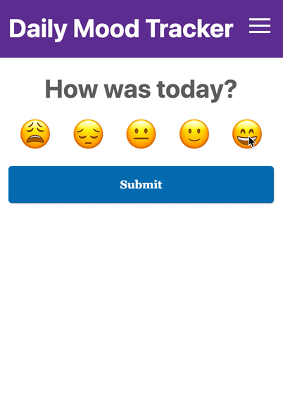

<!-- AUTO-GENERATED-CONTENT:START (STARTER) -->

  

<h1 align="center">
  Daily Mood Tracker
</h1>

Hey 👋

This is a little application to personally keep track of your moods on a scale from 😩 to 😄

Built with:
- [React](https://reactjs.org/)
- [Gatsby](https://www.gatsbyjs.org/)
- [Netlify](https://www.netlify.com/)
- [Emotion](https://emotion.sh/)
- [Serverless](https://serverless.com/) (API project can be found [here](https://github.com/JakePartusch/daily-mood-tracker-api))
